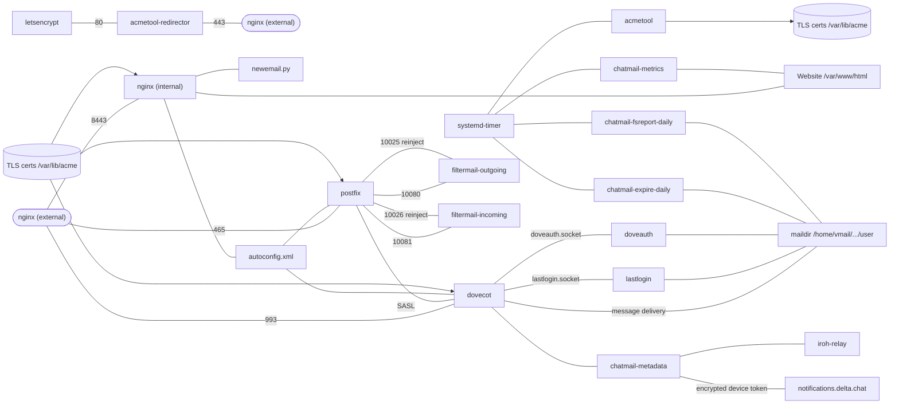

# Technical overview

## Directories of the relay repository

The [chatmail relay repository](https://github.com/chatmail/relay/tree/main/) has four main directories.

### scripts
[scripts](https://github.com/chatmail/relay/tree/main/scripts) offers two convenience tools for beginners:
- `initenv.sh` installs a local virtualenv Python environment and installs necessary dependencies.
- `scripts/cmdeploy` script enables you to run the `cmdeploy` command line tool in the local Python virtual environment.

### cmdeploy
The `cmdeploy` directory contains the Python package and command line tool to setup a chatmail relay remotely via SSH:
- `cmdeploy init` creates the `chatmail.ini` config file locally.
- `cmdeploy run` uses [pyinfra](https://pyinfra.com) to automatically install or upgrade all chatmail components on a relay.

The deployed system components of a chatmail relay are:
- **Postfix**: the Mail Transport Agent (MTA).
- **Dovecot**: the Mail Delivery Agent (MDA).
- **filtermail**: prevents unencrypted email from leaving or entering the service.
- **Nginx**: serves the web page and privacy policy.
- **acmetool**: manages TLS certificates.
- **OpenDKIM**: signs messages and validates inbound ones.
- **mtail**: collects anonymized metrics.
- **Iroh relay**: helps client devices establish P2P connections.
- **TURN**: enables WebRTC calls when P2P fails.

### chatmaild
[chatmaild](https://github.com/chatmail/relay/tree/main/chatmaild) is a Python package containing small services for:
- **doveauth**: implements create-on-login address semantics.
- **chatmail-metadata**: handles push notification tokens and user settings.
- **chatmail-expire**: deletes inactive users.
- **lastlogin**: tracks last login dates.
- **metrics**: displays relay metrics.

### www
[www](https://github.com/chatmail/relay/tree/main/www) contains the website files.

## Chatmail relay dependency diagram

## Operational details of a chatmail relay

### Mailbox directory layout
Fresh chatmail addresses have a mailbox directory containing:
- `password`: salted password file.
- `enforceE2EEincoming`: if present, rejects cleartext messages.
- `dovecot*`, `cur`, `new`, `tmp`: standard Maildir / Dovecot state.

### Active ports
- 25 (SMTP), 587 (SUBMISSION), 465 (SUBMISSIONS)
- 143 (IMAP), 993 (IMAPS)
- 80 (HTTP), 443 (HTTPS), 8443 (HTTPS-ALT)
- 3478 UDP (STUN/TURN)

### Email domain authentication (DKIM)
Chatmail relays enforce **DKIM** (RFC 6376) for incoming emails. Strict **DMARC** alignment (adkim=s) is applied. Inbound messages without valid DKIM are rejected with a "5.7.1 No valid DKIM signature found" error.

### TLS requirements
Postfix is configured to require valid TLS. If emails don’t arrive, ensure your relay has a valid TLS certificate chain.

## Architecture of `cmdeploy`
`cmdeploy` uses [pyinfra](https://pyinfra.com) for deployment. It performs three stages:
1. **Installation**: Software install across all deployments.
2. **Configuration**: Deploy-specific variations.
3. **Activation**: Enabling services.
