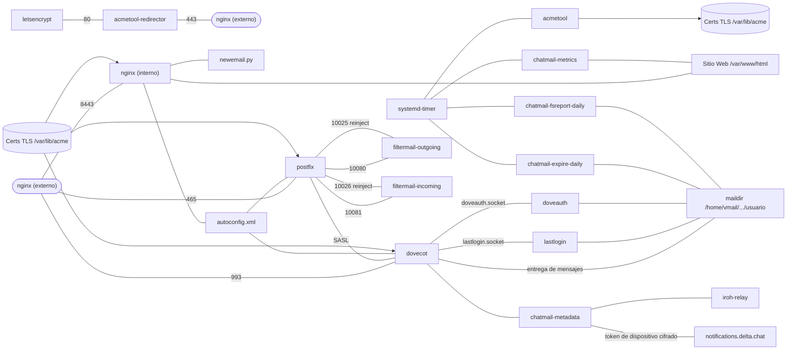

# Resumen técnico

## Directorios del repositorio del relay

El [repositorio del relay de chatmail](https://github.com/chatmail/relay/tree/main/) tiene cuatro directorios principales.

### scripts
[scripts](https://github.com/chatmail/relay/tree/main/scripts) ofrece dos herramientas de conveniencia para principiantes:
- `initenv.sh` instala un entorno virtual local de Python e instala las dependencias necesarias.
- El script `scripts/cmdeploy` permite ejecutar la herramienta de línea de comandos `cmdeploy` en el entorno virtual local de Python.

### cmdeploy
El directorio `cmdeploy` contiene el paquete Python y la herramienta de línea de comandos para configurar un relay de chatmail de forma remota a través de SSH:
- `cmdeploy init` crea el archivo de configuración `chatmail.ini` localmente.
- `cmdeploy run` utiliza [pyinfra](https://pyinfra.com) para instalar o actualizar automáticamente todos los componentes de chatmail en un relay.

Los componentes del sistema desplegados de un relay de chatmail son:
- **Postfix**: el Agente de Transporte de Correo (MTA).
- **Dovecot**: el Agente de Entrega de Correo (MDA).
- **filtermail**: evita que el correo electrónico sin cifrar salga o entre en el servicio.
- **Nginx**: sirve la página web y la política de privacidad.
- **acmetool**: gestiona los certificados TLS.
- **OpenDKIM**: firma los mensajes y valida los entrantes.
- **mtail**: recopila métricas anonimizadas.
- **Relay Iroh**: ayuda a los dispositivos cliente a establecer conexiones P2P.
- **TURN**: permite llamadas WebRTC cuando el P2P falla.

### chatmaild
[chatmaild](https://github.com/chatmail/relay/tree/main/chatmaild) es un paquete Python que contiene pequeños servicios para:
- **doveauth**: implementa la semántica de creación de direcciones al iniciar sesión.
- **chatmail-metadata**: maneja los tokens de notificaciones push y la configuración del usuario.
- **chatmail-expire**: elimina usuarios inactivos.
- **lastlogin**: rastrea las fechas de último inicio de sesión.
- **metrics**: muestra las métricas del relay.

### www
[www](https://github.com/chatmail/relay/tree/main/www) contiene los archivos del sitio web.

## Diagrama de dependencias del relay de chatmail

## Detalles operativos de un relay de chatmail

### Distribución del directorio de buzones
Las nuevas direcciones de chatmail tienen un directorio de buzón que contiene:
- `password`: archivo de contraseña con sal (salted).
- `enforceE2EEincoming`: si está presente, rechaza los mensajes en texto plano.
- `dovecot*`, `cur`, `new`, `tmp`: estado estándar de Maildir / Dovecot.

### Puertos activos
- 25 (SMTP), 587 (SUBMISSION), 465 (SUBMISSIONS)
- 143 (IMAP), 993 (IMAPS)
- 80 (HTTP), 443 (HTTPS), 8443 (HTTPS-ALT)
- 3478 UDP (STUN/TURN)

### Autenticación del dominio de correo (DKIM)
Los relays de chatmail imponen **DKIM** (RFC 6376) para los correos electrónicos entrantes. Se aplica una alineación estricta de **DMARC** (adkim=s). Los mensajes entrantes sin una firma DKIM válida se rechazan con un error "5.7.1 No valid DKIM signature found".

### Requisitos de TLS
Postfix está configurado para requerir TLS válido. Si los correos electrónicos no llegan, asegúrate de que tu relay tenga una cadena de certificados TLS válida.

## Arquitectura de `cmdeploy`
`cmdeploy` utiliza [pyinfra](https://pyinfra.com) para el despliegue. Realiza tres etapas:
1. **Instalación**: Instalación de software en todos los despliegues.
2. **Configuración**: Variaciones específicas del despliegue.
3. **Activación**: Activación de los servicios.
