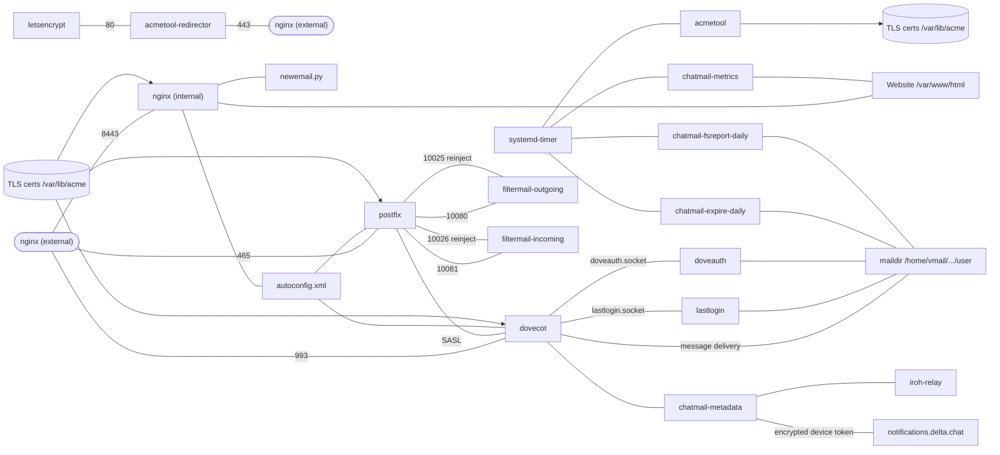

# نمای فنی

## دایرکتوری‌های مخزن رله

[مخزن رله chatmail](https://github.com/chatmail/relay/tree/main/) دارای چهار دایرکتوری اصلی است.

### scripts
[scripts](https://github.com/chatmail/relay/tree/main/scripts) دو ابزار کاربردی برای مبتدیان ارائه می‌دهد:
- `initenv.sh` یک محیط مجازی پایتون (virtualenv) محلی ایجاد کرده و نیازمندی‌های لازم را نصب می‌کند.
- اسکریپت `scripts/cmdeploy` به شما امکان می‌دهد ابزار خط فرمان `cmdeploy` را در محیط مجازی پایتون محلی اجرا کنید.

### cmdeploy
دایرکتوری `cmdeploy` شامل پکیج پایتون و ابزار خط فرمان برای راه‌اندازی رله chatmail از راه دور از طریق SSH است:
- `cmdeploy init` فایل پیکربندی `chatmail.ini` را به‌صورت محلی ایجاد می‌کند.
- `cmdeploy run` از [pyinfra](https://pyinfra.com) برای نصب یا ارتقای خودکار تمام اجزای chatmail روی یک رله استفاده می‌کند.

اجزای سیستم مستقر شده در یک رله chatmail عبارتند از:
- **Postfix**: عامل انتقال ایمیل (MTA).
- **Dovecot**: عامل تحویل ایمیل (MDA).
- **filtermail**: از خروج یا ورود ایمیل‌های غیررمزگذاری شده به سرویس جلوگیری می‌کند.
- **Nginx**: صفحه وب و سیاست حریم خصوصی را ارائه می‌دهد.
- **acmetool**: گواهی‌های TLS را مدیریت می‌کند.
- **OpenDKIM**: پیام‌ها را امضا کرده و پیام‌های ورودی را اعتبار‌سنجی می‌کند.
- **mtail**: معیارهای (metrics) ناشناس را جمع‌آوری می‌کند.
- **رله Iroh**: به دستگاه‌های کلاینت کمک می‌کند تا اتصالات P2P برقرار کنند.
- **TURN**: وقتی P2P شکست می‌خورد، تماس‌های WebRTC را امکان‌پذیر می‌کند.

### chatmaild
[chatmaild](https://github.com/chatmail/relay/tree/main/chatmaild) پکیجی پایتونی است که شامل سرویس‌های کوچک زیر است:
- **doveauth**: منطق ایجاد آدرس در اولین ورود (create-on-login) را پیاده‌سازی می‌کند.
- **chatmail-metadata**: توکن‌های نوتیفیکیشن (push) و تنظیمات کاربر را مدیریت می‌کند.
- **chatmail-expire**: کاربران غیرفعال را حذف می‌کند.
- **lastlogin**: تاریخ آخرین ورود را ردیابی می‌کند.
- **metrics**: معیارهای رله را نمایش می‌دهد.

### www
[www](https://github.com/chatmail/relay/tree/main/www) شامل فایل‌های وب‌سایت است.

## نمودار وابستگی رله Chatmail

## جزئیات عملیاتی رله chatmail

### ساختار دایرکتوری Mailbox
آدرس‌های جدید chatmail دارای یک دایرکتوری در صندوق پستی هستند که شامل موارد زیر است:
- `password`: فایل رمز عبور هش شده (salted).
- `enforceE2EEincoming`: در صورت وجود، پیام‌های متن ساده (cleartext) را رد می‌کند.
- `dovecot*`, `cur`, `new`, `tmp`: وضعیت استاندارد Maildir / Dovecot.

### پورت‌های فعال
- 25 (SMTP), 587 (SUBMISSION), 465 (SUBMISSIONS)
- 143 (IMAP), 993 (IMAPS)
- 80 (HTTP), 443 (HTTPS), 8443 (HTTPS-ALT)
- 3478 UDP (STUN/TURN)

### اعتبار‌سنجی دامنه ایمیل (DKIM)
رله‌های Chatmail برای ایمیل‌های ورودی **DKIM** (RFC 6376) را اجبار می‌کنند. تراز شدید **DMARC** (adkim=s) اعمال می‌شود. پیام‌های ورودی بدون امضای DKIM معتبر با خطای "5.7.1 No valid DKIM signature found" رد می‌شوند.

### الزامات TLS
Postfix به‌گونه‌ای پیکربندی شده که به TLS معتبر نیاز داشته باشد. اگر ایمیل‌ها نمی‌رسند، اطمینان حاصل کنید که رله شما دارای زنجیره گواهی TLS معتبر است.

## معماری `cmdeploy`
`cmdeploy` از [pyinfra](https://pyinfra.com) برای استقرار استفاده می‌کند و سه مرحله را انجام می‌دهد:
1. **نصب (Installation)**: نصب نرم‌افزار در تمام استقرارها.
2. **پیکربندی (Configuration)**: تغییرات خاص هر استقرار.
3. **فعال‌سازی (Activation)**: فعال کردن سرویس‌ها.
