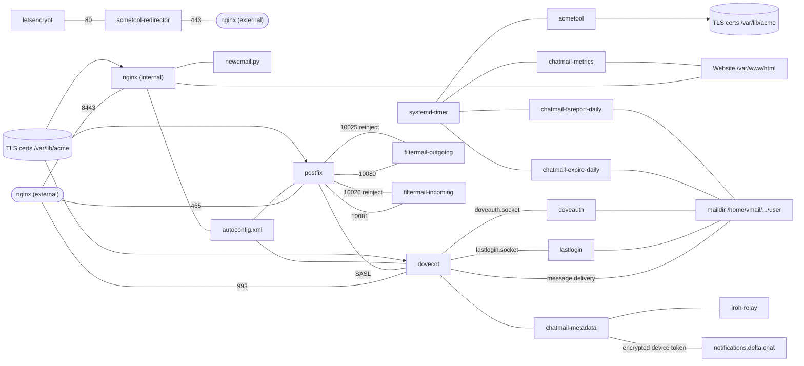

# Технический обзор

## Директории репозитория реле

[Репозиторий реле chatmail](https://github.com/chatmail/relay/tree/main/) состоит из четырех основных директорий.

### scripts
Директория [scripts](https://github.com/chatmail/relay/tree/main/scripts) предлагает два удобных инструмента для начинающих:
- `initenv.sh` устанавливает локальную виртуальную среду Python (virtualenv) и необходимые зависимости.
- Сценарий `scripts/cmdeploy` позволяет запускать инструмент командной строки `cmdeploy` в локальной виртуальной среде Python.

### cmdeploy
Директория `cmdeploy` содержит пакет Python и инструмент командной строки для удаленной настройки реле chatmail через SSH:
- `cmdeploy init` создает локальный конфигурационный файл `chatmail.ini`.
- `cmdeploy run` использует [pyinfra](https://pyinfra.com) для автоматической установки или обновления всех компонентов chatmail на реле.

Развернутые системные компоненты реле chatmail:
- **Postfix**: агент передачи почты (MTA).
- **Dovecot**: агент доставки почты (MDA).
- **filtermail**: предотвращает попадание незашифрованных писем в сервис или их выход за его пределы.
- **Nginx**: обслуживает веб-страницу и политику конфиденциальности.
- **acmetool**: управляет TLS-сертификатами.
- **OpenDKIM**: подписывает сообщения и проверяет входящие.
- **mtail**: собирает анонимизированные метрики.
- **Реле Iroh**: помогает клиентским устройствам устанавливать P2P-соединения.
- **TURN**: обеспечивает возможность видеозвонков WebRTC, когда P2P-соединение невозможно.

### chatmaild
[chatmaild](https://github.com/chatmail/relay/tree/main/chatmaild) — это пакет Python, содержащий небольшие сервисы для:
- **doveauth**: реализует семантику создания адреса при первом входе.
- **chatmail-metadata**: обрабатывает токены пуш-уведомлений и настройки пользователей.
- **chatmail-expire**: удаляет неактивных пользователей.
- **lastlogin**: отслеживает даты последнего входа.
- **metrics**: отображает метрики реле.

### www
Директория [www](https://github.com/chatmail/relay/tree/main/www) содержит файлы веб-сайта.

## Схема зависимостей реле Chatmail

## Эксплуатационные детали реле chatmail

### Структура директории почтового ящика
Новые адреса chatmail имеют директорию почтового ящика, содержащую:
- `password`: файл с хешированным паролем (с солью).
- `enforceE2EEincoming`: если присутствует, отклоняет незашифрованные сообщения.
- `dovecot*`, `cur`, `new`, `tmp`: стандартные состояния Maildir / Dovecot.

### Активные порты
- 25 (SMTP), 587 (SUBMISSION), 465 (SUBMISSIONS)
- 143 (IMAP), 993 (IMAPS)
- 80 (HTTP), 443 (HTTPS), 8443 (HTTPS-ALT)
- 3478 UDP (STUN/TURN)

### Аутентификация почтового домена (DKIM)
Реле Chatmail требуют обязательного наличия **DKIM** (RFC 6376) для входящих писем. Применяется строгое соответствие **DMARC** (adkim=s). Входящие сообщения без валидной подписи DKIM отклоняются с ошибкой «5.7.1 No valid DKIM signature found».

### Требования к TLS
Postfix настроен на обязательное использование валидного TLS. Если электронные письма не доходят, убедитесь, что ваше реле имеет валидную цепочку TLS-сертификатов.

## Архитектура `cmdeploy`
`cmdeploy` использует [pyinfra](https://pyinfra.com) для развертывания. Оно выполняется в три этапа:
1. **Установка**: установка программного обеспечения во всех развертываниях.
2. **Конфигурация**: специфические для каждого развертывания варианты настроек.
3. **Активация**: включение сервисов.
